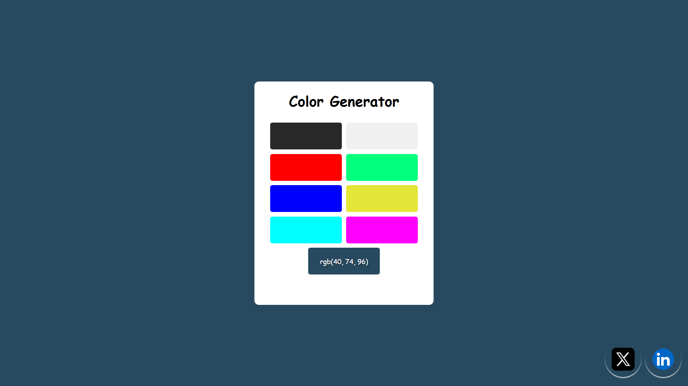

# 🎨 Color Generator

A simple and interactive color generator built with **HTML**, **CSS**, and **JavaScript**.  
Easily change the background color of the page by clicking on preset color blocks or generate a random color with a single click!



---

## ✨ Features

- **Preset Colors:** Choose from a palette of 8 popular colors.
- **Random Color Generator:** Instantly generate a random color and apply it as the background.
- **Live Preview:** The selected color is shown both on the button and as the page background.
- **Responsive Design:** Clean and centered layout for all devices.
- **Social Links:** Quick access to X (Twitter) and LinkedIn profiles.

---

## 🚀 Getting Started

1. **Clone the repository:**
   ```bash
   git clone https://github.com/your-username/color-generator.git
   ```
2. **Navigate to the project folder:**
   ```bash
   cd color-generator
   ```
3. **Open `index.html` in your browser.**

---

## 🛠️ Project Structure

```
color-generator/
│
├── index.html        # Main HTML file
├── style.css         # Stylesheet
├── main.js           # JavaScript for color logic
├── x.jpg             # X (Twitter) icon
├── linkedin.jpg      # LinkedIn icon
└── README.md         # This file
```

---

## 💡 How It Works

### HTML (`index.html`)

- The `.contener` div holds the title and color blocks.
- There are 8 `.color-container` divs for preset colors and 1 for the random color generator (with id `random-color`).
- Social media buttons are fixed at the bottom right.

### CSS (`style.css`)

- Uses Flexbox to center the generator on the page.
- `.color-container` blocks are styled as clickable color swatches.
- `.social-buttons` are positioned at the bottom right for easy access.

### JavaScript (`main.js`)

- **Selects all color blocks** and the body element.
- **Preset Colors:**  
  Loops through each `.color-container` and assigns a color from the `colors` array.  
  When a color block is clicked, the page background changes to that color.
- **Random Color:**  
  When the random color block is clicked, a new RGB color is generated, displayed, and set as the background.

**Key logic:**

```js
const colors_contaner = document.querySelectorAll(".color-container");
const body = document.querySelector("body");
const random_color = document.querySelector("#random-color");
const colors = [
  "#282828",
  "#f0f0f0",
  "rgb(255, 0, 0)",
  "rgb(0, 255, 123)",
  "rgb(0, 0, 255)",
  "rgb(229, 229, 55)",
  "rgb(0, 255, 255)",
  "rgb(255, 0, 255)",
];

colors_contaner.forEach((color, idx) => {
  color.style.backgroundColor = colors[idx];
  color.addEventListener("click", () => {
    body.style.backgroundColor = colors[idx];
  });
});

random_color.addEventListener("click", () => {
  const randomcolor =
    "rgb(" +
    Math.floor(Math.random() * 254) +
    ", " +
    Math.floor(Math.random() * 254) +
    ", " +
    Math.floor(Math.random() * 254) +
    ")";
  random_color.style.backgroundColor = randomcolor;
  const text = random_color.children[0];
  text.innerText = randomcolor;
  body.style.backgroundColor = randomcolor;
});
```

---

## 📸 Preview


---

## 🔗 Social Links

- [X (Twitter)](https://x.com/Arijit_Mandal1)
- [LinkedIn](https://www.linkedin.com/in/arijit-mandal-545153305/)

---

## 📄 License

This project is open source and available under the [MIT License](LICENSE).

---

> Made with ❤️ by Arijit
