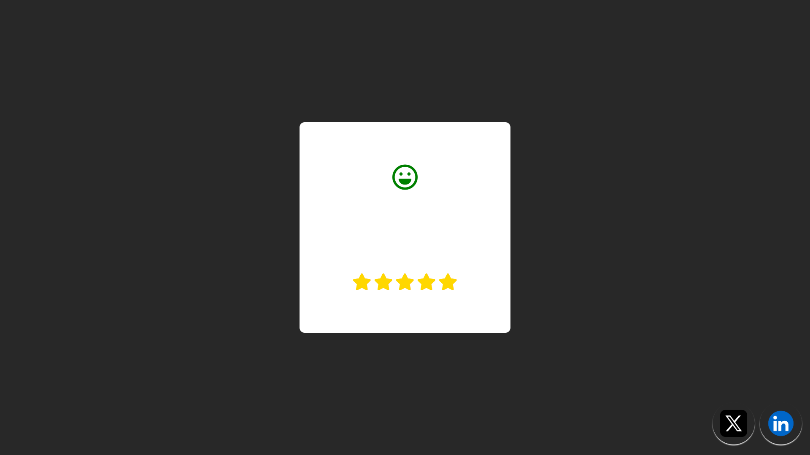

# 😃 Emoji Rating

A fun and interactive emoji rating component built with **HTML**, **CSS**, and **JavaScript**.  
Users can select a rating by clicking on stars, and the emoji face and color change dynamically to reflect the mood!



---

## ✨ Features

- **Interactive Rating:** Click on stars to set your rating.
- **Animated Emojis:** Emoji face and color change based on the selected rating.
- **Responsive Design:** Looks great on all devices.
- **Modern UI:** Clean, simple, and easy to customize.
- **Social Links:** Quick access to X (Twitter) and LinkedIn profiles.

---

## 🚀 Getting Started

1. **Clone the repository:**
   ```bash
   git clone https://github.com/your-username/emoji-rating.git
   ```
2. **Navigate to the project folder:**
   ```bash
   cd emoji-rating
   ```
3. **Open `index.html` in your browser.**

---

## 🛠️ Project Structure

```
emoji-rating/
│
├── index.html        # Main HTML file
├── style.css         # Stylesheet
├── main.js           # JavaScript for emoji rating logic
├── x.jpg             # X (Twitter) icon
├── linkedin.jpg      # LinkedIn icon
└── README.md         # This file
```

---

## 💡 How It Works

### HTML (`index.html`)

- The main container `.contener` holds the emoji faces and the star rating.
- Five emoji icons are stacked horizontally, and five stars are displayed below.
- Social media buttons (X and LinkedIn) are fixed at the bottom right.

### CSS (`style.css`)

- The layout is centered using Flexbox.
- `.emoji` and `.rating` are absolutely positioned inside the container.
- `.social-buttons` are absolutely positioned at the bottom right.
- Emojis and stars have hover and active effects for better UX.

### JavaScript (`main.js`)

- Selects all stars and emojis.
- When a star is clicked, it:
  - Activates the correct number of stars.
  - Slides the emoji faces to show the one matching the rating.
  - Changes the emoji color based on the rating.

**Key logic:**

```js
const stars = document.querySelectorAll(".fa-star");
const emojis = document.querySelectorAll(".far");
const colorsArray = ["red", "orange", "lightblue", "lightgreen", "green"];

updateRating(0);

stars.forEach((star, index) => {
  star.addEventListener("click", () => {
    updateRating(index);
  });
});

function updateRating(index) {
  stars.forEach((star, idx) => {
    if (idx < index + 1) {
      star.classList.add("active");
    } else {
      star.classList.remove("active");
    }
  });

  emojis.forEach((emojiEl) => {
    emojiEl.style.transform = `translateX(-${index * 50}px)`;
    emojiEl.style.color = colorsArray[index];
  });
}
```

---

---

## 🔗 Social Links

- [X (Twitter)](https://x.com/Arijit_Mandal1)
- [LinkedIn](https://www.linkedin.com/in/arijit-mandal-545153305/)

---

## 📄 License

This project is open source and available under the [MIT License](LICENSE).

---

> Made with ❤️ by Arijit Mandal
