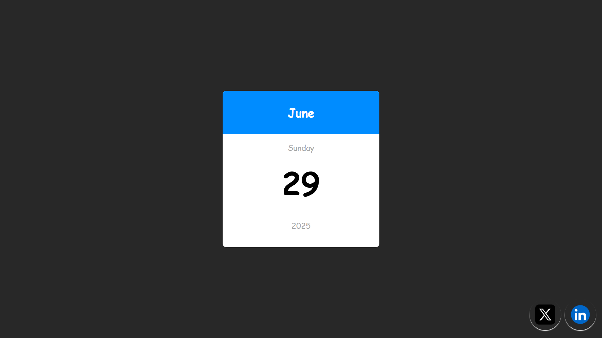

# 📅 Mini Calendar

A clean and modern mini calendar web component built with **HTML**, **CSS**, and **JavaScript**.  
Displays the current month, day, and year in a stylish card, with quick links to social profiles.



---

## ✨ Features

- **Responsive Design:** Looks great on all devices.
- **Dynamic Date:** Automatically shows the current date.
- **Modern UI:** Simple, elegant, and easy to customize.
- **Social Links:** Quick access to X (Twitter) and LinkedIn profiles.

---

## 🚀 Getting Started

1. **Clone the repository:**
   ```bash
   git clone https://github.com/your-username/mini-calendar.git
   ```
2. **Navigate to the project folder:**
   ```bash
   cd mini-calendar
   ```
3. **Open `index.html` in your browser.**

---

## 🛠️ Project Structure

```
mini-calendar/
│
├── index.html        # Main HTML file
├── style.css         # Stylesheet
├── main.js           # JavaScript for dynamic date
├── x.jpg             # X (Twitter) icon
├── linkedin.jpg      # LinkedIn icon
└── README.md         # This file
```

---

## 📸 Preview


---

## 🔗 Social Links

- [X (Twitter)](https://x.com/Arijit_Mandal1)
- [LinkedIn](https://www.linkedin.com/in/arijit-mandal-545153305/)

---

## 📄 License

This project is open source and available under the [MIT License](LICENSE).

---

> Made with ❤️ by
